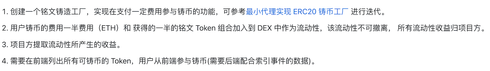
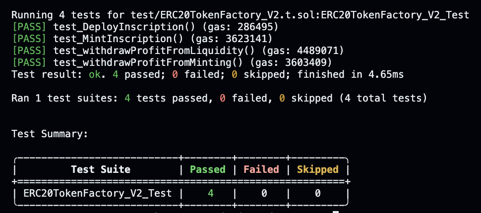
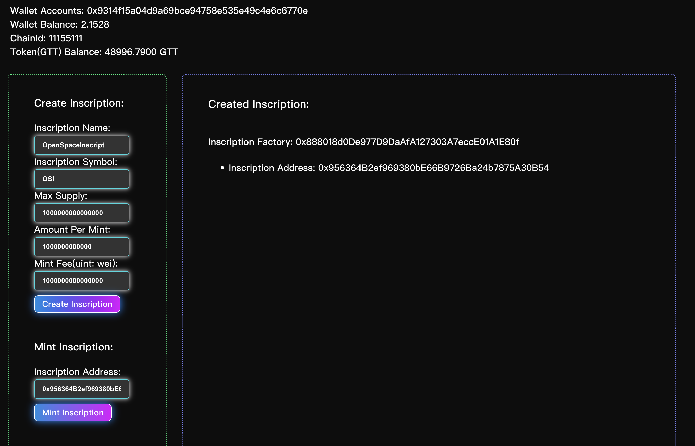
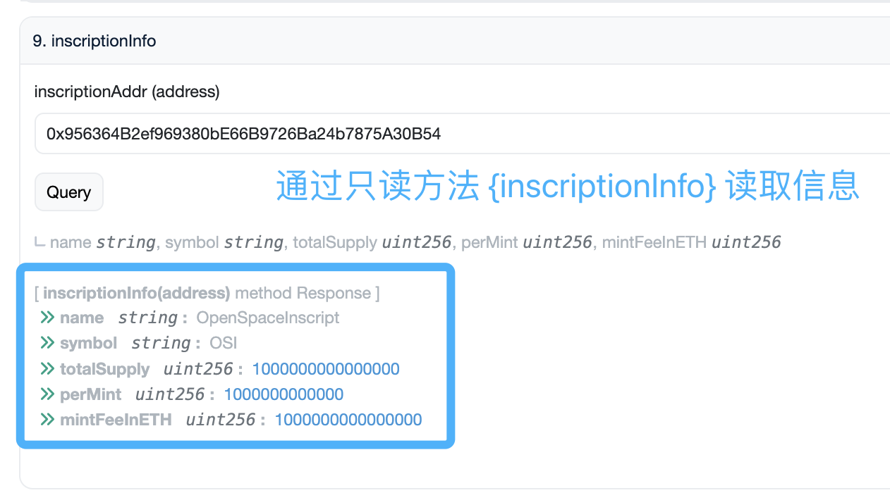

# 练习题（02.28）



## 1. 合约部署信息

- **UniswapV2Factory_Customized**（Uniswap v2 Factory 合约的改写版）：https://sepolia.etherscan.io/address/0xd7aea5f7f6dbc8f7772162ebe1367c1f4d7d377f
- **WETH9**：https://sepolia.etherscan.io/address/0xebe8d728847fd06179f19070e9288dd207def69d
- **UniswapV2Router02_Customized**（Uniswap v2 Router02 合约的改写版）：https://sepolia.etherscan.io/address/0x8fcdfaebb375858fbbd3e8987f45ba77c8ee2ec9
- **FairTokenGFT_V2**（铭文的实现合约）：https://sepolia.etherscan.io/address/0x68a2f5be9a4b5ac57e4a8357cbc2cde713239ada
- **ERC20TokenFactory_V2**（铭文的铸造工厂合约）：https://sepolia.etherscan.io/address/0x888018d0de977d9daafa127303a7ecce01a1e80f

## 2. ERC20TokenFactory_V2 合约（铭文铸造工厂）

### a. 状态变量 和 事件说明（仅与本练习题要求相关的部分内容）

```solidity
contract ERC20TokenFactory_V2 is Ownable {
	// 其他逻辑...
		
		address private libraryAddress;		// 实现合约的地址
    address public routerAddress;			// DEX 的 router 合约地址
    
    // 铭文信息结构体
    struct InscriptionStruct {	
        string name;						// 铭文名称
        string symbol;					// 铭文标识
        uint256 totalSupply;		// 铭文最大供应量
        uint256 perMint;				// 铭文单次铸造的数量
        uint256 mintFeeInETH;		// 铭文单次铸造的费用（单位：wei）
    }
    
    // 映射（铭文合约地址 => 铭文信息结构体）
    mapping(address inscriptionAddr => InscriptionStruct info) public inscriptionInfo;
    // 通过用户铸造铭文而为 DEX 提供流动性所获得的 LP token 的数量（添加流动性所获得的，不包含流动性收益所增发的）
    uint256 private LPAmount_AddingLiquidity;
    // 用户铸造铭文的费用的 ETH 收益
    uint256 private profitOfMint;
    // 用户提供流动性所获得的 ETH 收益
    uint256 private profitOfLP;
    // 当铭文合约创建时触发
    event InscriptionCreated(address instanceAddress);
    // 当铭文被铸造时触发
    event InscriptionMinted(address inscriptAddr, uint256 mintedAmount, uint256 liquidityAdd);
    // 当铭文项目方提取流动性收益时触发（提取收益对应的增发的 LP token 对应的 ETH 和 铭文 token）
    event LiquidityProfitWithdrawn(
        address indexed inscriptAddr, uint256 LPAmount, uint256 indexed tokenAmount, uint256 indexed ETHAmount);
    // 当铭文项目方提取用户铸造费用的 ETH 收益时触发
    event MintingProfitWithdrawn(address owner, uint256 withdrawnAmount);
    
	// 其他逻辑...
```

-----

### b. 方法 {deployInscription} ：创建新的铭文合约

```solidity
function deployInscription(
        string memory _tokenName,
        string memory _tokenSymbol,
        uint256 _tokenTotalSupply,
        uint256 _perMint,
        uint256 _mintFeeInETH
    ) public returns (address) {
        require(_tokenTotalSupply != 0 && _tokenTotalSupply % 2 == 0, "Total Supply should be an even non-zero number");
        require(_perMint != 0 && _perMint % 2 == 0, "Minted amount should be an even non-zero number");
        // 基于实现合约的逻辑，通过最小代理部署的铭文合约
        address clonedImpleInstance = libraryAddress.clone();
        // 使用结构体 InscriptionStruct 变量来记录铭文的基础信息
        InscriptionStruct memory deployedInscription = InscriptionStruct({
            name: _tokenName,
            symbol: _tokenSymbol,
            totalSupply: _tokenTotalSupply,
            perMint: _perMint,
            mintFeeInETH: _mintFeeInETH
        });
        // 赋值给状态变量 inscriptionInfo（映射：铭文地址 => 铭文信息结构体）
        inscriptionInfo[clonedImpleInstance] = deployedInscription;
        // 初始化新创建的铭文合约
        FairTokenGFT_V2(clonedImpleInstance).init(address(this), _tokenName, _tokenSymbol);
        emit InscriptionCreated(clonedImpleInstance);
        return clonedImpleInstance;
    }
```

-----

### c. 方法 {mintInscription} ：铸造铭文

```Solidity
function mintInscription(address _tokenAddr) public payable {
        _beforeMintInscription(_tokenAddr);
        // 计算一半的铸造的铭文数量
        uint256 halfMintedToken = inscriptionInfo[_tokenAddr].perMint / 2;
        // 计算一半的铸造费用
        uint256 halfFee = msg.value / 2;
        uint256 balanceBefore = FairTokenGFT_V2(_tokenAddr).balanceOf(address(this));
        // 为当前合约铸造铭文
        FairTokenGFT_V2(_tokenAddr).mint(address(this), halfMintedToken);
        // 为用户铸造铭文
        FairTokenGFT_V2(_tokenAddr).mint(msg.sender, halfMintedToken);
        // 比较给当前合约铸造的铭文前后余额对比，检查铸造数量
        uint256 balanceAfter = FairTokenGFT_V2(_tokenAddr).balanceOf(address(this));
        if (balanceAfter <= balanceBefore || balanceAfter - balanceBefore != halfMintedToken) {
            uint256 balanceDelta = balanceAfter <= balanceBefore ? 0 : balanceAfter - balanceBefore;
            revert InvalidAmountMintedBack(_tokenAddr, balanceDelta, halfMintedToken);
        }
        // 为 DEX 的 Router 合约（UniswapV2Router02_Customized 合约）授权另一半铭文的铸造数量
        bool isApproved = FairTokenGFT_V2(_tokenAddr).approve(routerAddress, halfMintedToken);
        require(isApproved, "Fail to approve");
        // 将一半数量的新铸造的铭文和一半的铸造费用添加流动性到 DEX 中
        (uint256 amountToken, uint256 amountETH, uint256 liquidity) = UniswapV2Router02_Customized(
            payable(routerAddress)
        ).addLiquidityETH{value: halfFee}(_tokenAddr, halfMintedToken, 0, 0, address(this), block.timestamp + 600);
        // 计算未被加入到流动性中的铭文数量（以供后续返还未注入流动性的铭文给用户）
        uint256 tokenToBeRefunded = halfMintedToken - amountToken;
        // 返还多余的铭文
        if (tokenToBeRefunded > 0) {
            bool _ok = FairTokenGFT_V2(_tokenAddr).transfer(msg.sender, halfMintedToken - amountToken);
            require(_ok, "Fail to refund inscription");
        }
        uint256 ETHToBeRefunded = halfFee - amountETH;
        // 返还多余的 ETH
        if (ETHToBeRefunded > 0) {
            (bool _success,) = payable(msg.sender).call{value: halfFee - amountETH}("");
            require(_success, "Fail to refund ETH");
        }
        // 更新提供流动性所获得的 LP token 的总量
        LPAmount_AddingLiquidity += liquidity;
        // 更新铸造费用的 ETH 总收益
        profitOfMint += halfFee;
        emit InscriptionMinted(_tokenAddr, inscriptionInfo[_tokenAddr].perMint, liquidity);
    }
```

-------

### d. 方法 {withdrawProfitFromMinting}：项目方提取用户铸造铭文对应的收益

```solidity
    function withdrawProfitFromMinting(uint256 _amount) external onlyOwner {
        address owner = owner();
        if (_amount > address(this).balance) {
            revert InsufficientProfitOfMint(profitOfMint, _amount);
        }
        profitOfMint -= _amount;
        payable(owner).call{value: _amount}("");
        emit MintingProfitWithdrawn(owner, _amount);
    }
```

----

#### e. 方法 {withdrawProfitFromLiquidity}：项目方提取流动性的收益

```solidity
function withdrawProfitFromLiquidity(
        address _tokenAddr,
        uint256 _LPAmountWithdrawn,
        uint256 _tokenMin,
        uint256 _ETHMin
    ) external onlyOwner returns (uint256 tokenAmount, uint256 ETHAmount) {
    		// 调用父合约 Ownable 方法获取当前铸造工厂的 owner
        address owner = owner();
        // 调用内部方法获取 pair 合约（即 LP token 合约）的地址
        address pair = getPairAddress(_tokenAddr);
        // 调用 LP token 合约的 {approve} 方法为 Router 合约授权（以供 transferFrom LP token 给 router 合约销毁）
        bool isApproved = UniswapV2Pair_Customized(pair).approve(routerAddress, _LPAmountWithdrawn);
        require(isApproved, "Fail to approve router");
        // 调用 Router 合约的 {withdrawProfitFromLiquidityETH} 方法将 LP token 转入并提取对应的收益（币对）
        (tokenAmount, ETHAmount) = UniswapV2Router02_Customized(payable(routerAddress)).withdrawProfitFromLiquidityETH(
            _tokenAddr, _LPAmountWithdrawn, _tokenMin, _ETHMin, address(this), block.timestamp + 600
        );
        // 将提出的流动性收益（两种币：铭文 token 和 ETH）转给铸造工厂的 owner
        bool _ok = FairTokenGFT_V2(_tokenAddr).transfer(owner, tokenAmount);
        require(_ok, "Fail to withdraw token");
        (bool _success,) = payable(owner).call{value: ETHAmount}("");
        require(_success, "Fail to withdraw ETH");
        emit LiquidityProfitWithdrawn(_tokenAddr, _LPAmountWithdrawn, tokenAmount, ETHAmount);
    }
```

----

#### f. 只读方法 {getPairAddress}：获取 LP token 合约地址

```solidity
function getPairAddress(address _inscriptionAddr) public view returns (address) {
        address factory = UniswapV2Router02_Customized(payable(routerAddress)).factory();
        address WETHAddress = UniswapV2Router02_Customized(payable(routerAddress)).WETH();
        address pairAddress = UniswapV2Library_Customized.pairFor(factory, _inscriptionAddr, WETHAddress);
        return pairAddress;
    }
```

-----

#### g. 只读方法 {getLPProfitAmount}：获取可用于提取流动性收益的 LP token 数量

注：此方法便于在调用 {[withdrawProfitFromLiquidity](#e. 方法 {withdrawProfitFromLiquidity}：项目方提取流动性的收益)} 之前获知参数`_LPAmountWithdrawn`的上限。

```solidity
function getLPProfitAmount(address _inscriptionAddr) public view onlyOwner returns (uint256) {
        address pair = getPairAddress(_inscriptionAddr);
        uint256 liquidityAdded = UniswapV2Pair_Customized(pair).estimateFee();
        return liquidityAdded;
    }
```

-----

#### h. 内部方法 {_beforeMintInscription}：在铸造铭文之前的检查

```solidity
function _beforeMintInscription(address _tokenAddr) internal view {
        uint256 currentTotalSupply = FairTokenGFT_V2(_tokenAddr).totalSupply();
        uint256 amountPerMint = inscriptionInfo[_tokenAddr].perMint;
        uint256 maxSupply = inscriptionInfo[_tokenAddr].totalSupply;】
 				// 检查铸造之后的铭文总供应量是否大于限值
        if (currentTotalSupply + amountPerMint > maxSupply) {
            revert ReachMaxSupply(_tokenAddr, currentTotalSupply, amountPerMint, maxSupply);
        }
        // 检查用户给出的铸造费用是否足够
        if (msg.value < inscriptionInfo[_tokenAddr].mintFeeInETH) {
            revert InsufficientETHGiven(msg.sender, msg.value);
        }
    }
```


## 3. DEX “改写版”合约代码

为实现练习题的以下要求：

- 铸造铭文所添加的流动性不可撤离
- 所有流动性收益归项目方
- 项目方提取流动性所产生的收益

现基于 Uniswap V2 原版代码改写了部分合约，其中包括：

- **UniswapV2Pair** 合约：改写版为 **UniswapV2Pair_Customized** 。
- **UniswapV2Router02** 合约：改写版为 **UniswapV2Router02_Customized** 。

### a. UniswapV2Pair_Customized 合约

#### 方法 {handleLiquidityProfit}：计算输入的 LP token 的数量对应的两种币

```solidity
function handleLiquidityProfit(address to, uint liquidityAmount) external lock returns (uint amount0Profit, uint amount1Profit) {
				// 获取两种币（WETH 铭文 token）的上次记录（在 LP token 被 mint、burn、swap 或其他更新时）的储备量
        (uint112 _reserve0, uint112 _reserve1,) = getReserves(); 
				// 为了节省 gas ，此处用局部变量获取状态变量的值用于后续逻辑
        address _token0 = token0;                                
        address _token1 = token1;
        // 获取当前本合约中的两种 token 的数量
        uint balance0 = IERC20(_token0).balanceOf(address(this));
        uint balance1 = IERC20(_token1).balanceOf(address(this));
				// 为流动性收益的接收者增发流动性收益对应的 LPtoken
        (bool feeOn, ) = _mintFeeReturned(_reserve0, _reserve1);
        // 为了节省 gas ，此处用局部变量获取 LP token 在增发后的总供应量
        uint _totalSupply = totalSupply; 
        // 基于输入值`liquidityAmount`计算所对应的两种 token 的数量
        amount0Profit = liquidityAmount.mul(balance0) / _totalSupply; 
        amount1Profit = liquidityAmount.mul(balance1) / _totalSupply; 
        require(amount0Profit > 0 && amount1Profit > 0, 'UniswapV2_Customized: INSUFFICIENT_LIQUIDITY');
				// 基于输入值`liquidityAmount`，销毁相应的 LP token
        _burn(address(this), liquidityAmount);
        // 将两种 token 转入`to`地址
        _safeTransfer(_token0, to, amount0Profit);
        _safeTransfer(_token1, to, amount1Profit);
				// 更新当前合约内的两种 token 的余额
        balance0 = IERC20(_token0).balanceOf(address(this));
        balance1 = IERC20(_token1).balanceOf(address(this));
        // 更新两种 token 的储备量
        _update(balance0, balance1, _reserve0, _reserve1);
				// 当流动性存在收益的接收者时，则为状态变量`kLast`更新当前的 K 值（用于下次计算流动性收益的快照）
        if (feeOn) kLast = uint(reserve0).mul(reserve1); 
        emit Burn(msg.sender, amount0Profit, amount1Profit, to);
    }
```

----

#### 内部方法 {_mintFeeReturned}：计算流动性收益对应的需增发的 LP token

```Solidity
function _mintFeeReturned(uint112 _reserve0, uint112 _reserve1) private returns (bool feeOn, uint liquidityAdded) {
        address feeTo = IUniswapV2Factory(factory).feeTo();
        feeOn = feeTo != address(0);
        uint _kLast = kLast; // gas savings
        if (feeOn) {
            if (_kLast != 0) {
                uint rootK = Math.sqrt(uint(_reserve0).mul(_reserve1));
                uint rootKLast = Math.sqrt(_kLast);
                if (rootK > rootKLast) {
                    uint numerator = totalSupply.mul(rootK.sub(rootKLast));
                    uint denominator = rootK.mul(5).add(rootKLast);
                    liquidityAdded = numerator / denominator;
                    if (liquidityAdded > 0) _mint(feeTo, liquidityAdded);
                }
            }
        } else if (_kLast != 0) {
            kLast = 0;
        }
    }
```

----

### b. UniswapV2Router02_Customized 合约

#### 方法 {withdrawProfitFromLiquidityETH}：获取流动性收益（币对：token 与 ETH）

```Solidity
function withdrawProfitFromLiquidityETH(
        address token,
        uint256 liquidity,
        uint256 amountTokenMin,
        uint256 amountETHMin,
        address to,
        uint256 deadline
    ) public ensure(deadline) returns (uint256 amountToken, uint256 amountETH) {
    		// 调用方法{withdrawProfitFromLiquidity}提取铭文 token 和 WETH 到当前合约
        (amountToken, amountETH) =
            withdrawProfitFromLiquidity(token, WETH, liquidity, amountTokenMin, amountETHMin, address(this), deadline);
        // 将提取出的铭文 token 发送给`to`地址（即项目方地址）
        TransferHelper.safeTransfer(token, to, amountToken);
        // 将提取出的 WETH 转为 ETH（仍在本合约内）
        IWETH(WETH).withdraw(amountETH);
        // 将提取出的 ETH 发送给`to`地址（即项目方地址）
        TransferHelper.safeTransferETH(to, amountETH);
    }
```

---

#### 方法 {withdrawProfitFromLiquidity}：获取流动性收益（币对：token 与 token）

```solidity
function withdrawProfitFromLiquidity(
        address tokenA,
        address tokenB,
        uint256 liquidity,
        uint256 amountAMin,
        uint256 amountBMin,
        address to,
        uint256 deadline
    ) public ensure(deadline) returns (uint256 amountA, uint256 amountB) {
    		// 获取 LP token 的合约地址
        address pair = UniswapV2Library_Customized.pairFor(factory, tokenA, tokenB);
        // 计算流动性产生的收益所增发的 LP token 的数量（即可用于提取收益的 LP token 的数量）
        uint256 liquidityAdded = UniswapV2Pair_Customized(pair).estimateFee();
        // 检查输入值`liquidity`是否超过了可用于提取收益的 LP token 的数量
        require(liquidity <= liquidityAdded, "Withdrawal exceeds the current profit of LP");
        // 将 LP token 从调用者地址转移至 LP token 合约地址（需要调用者提前授权当前合约）
        UniswapV2Pair_Customized(pair).transferFrom(msg.sender, pair, liquidity);
        // 调用 LP token 合约中的{handleLiquidityProfit}方法
        (uint256 amount0Earned, uint256 amount1Earned) = UniswapV2Pair_Customized(pair).handleLiquidityProfit(to, liquidity);
        // 为输入的两种 token 的地址做排序，保证两者在做币对时始终拥有唯一的排序（按照地址的大小排序）
        (address token0,) = UniswapV2Library_Customized.sortTokens(tokenA, tokenB);
        // 将两种 token 的提取数量赋值给返回值变量
        (amountA, amountB) = tokenA == token0 ? (amount0Earned, amount1Earned) : (amount1Earned, amount0Earned);
        // 检查两种 token 的提取数量是否能够满足用户输入的最小提取量
        require(amountA >= amountAMin, "UniswapV2Router: INSUFFICIENT_A_AMOUNT");
        require(amountB >= amountBMin, "UniswapV2Router: INSUFFICIENT_B_AMOUNT");
    }
```


## 4. 测试用例与结果

### a. 测试用例代码

```solidity
// SPDX-License-Identifier: UNLICENSED
pragma solidity ^0.8.13;

import {WETH9} from '../src/Uniswap_v2_periphery/WETH9.sol';
import {UniswapV2Router02_Customized} from '../src/Uniswap_v2_periphery/UniswapV2Router02_Customized.sol';
import {UniswapV2Factory_Customized} from '../src/Uniswap_v2_core/UniswapV2Factory_Customized.sol';
import {FairTokenGFT_V2} from '../src/FairTokenGFT_V2.sol';
import {ERC20TokenFactory_V2} from '../src/ERC20TokenFactory_V2.sol';
import {UniswapV2Library_Customized} from "../src/Uniswap_v2_periphery/libraries/UniswapV2Library_Customized.sol";
import {UniswapV2Pair_Customized} from "../src/Uniswap_v2_core/UniswapV2Pair_Customized.sol";

import {Test, console} from "forge-std/Test.sol";

contract ERC20TokenFactory_V2_Test is Test {
    address alice = makeAddr("alice");
    address bob = makeAddr("bob");
    address carol = makeAddr("carol");

    WETH9 public WETHContract;
    UniswapV2Factory_Customized public UNI_FactoryContract;
    UniswapV2Router02_Customized public UNI_RouterContract;
    FairTokenGFT_V2 public implementContract;
    ERC20TokenFactory_V2 public inscriptFactoryContract;

    address public WETHAddr;
    address public UNI_FactoryAddr;
    address public UNI_RouterAddr;
    address public implementAddr;
    address public inscriptFactoryAddr;
    

    function setUp() public {
        vm.startPrank(alice);
        WETHContract = new WETH9();
        WETHAddr = address(WETHContract);
        UNI_FactoryContract = new UniswapV2Factory_Customized(alice);
        UNI_FactoryAddr = address(UNI_FactoryContract);
        UNI_RouterContract = new UniswapV2Router02_Customized(UNI_FactoryAddr, WETHAddr);
        UNI_RouterAddr = address(UNI_RouterContract);
        implementContract = new FairTokenGFT_V2();
        implementAddr = address(implementContract);
        inscriptFactoryContract = new ERC20TokenFactory_V2(implementAddr, UNI_RouterAddr);
        inscriptFactoryAddr = address(inscriptFactoryContract);
        vm.stopPrank();
    }

    function test_DeployInscription() public {
        deal(alice, 200000 ether);
        vm.startPrank(alice);
        address inscriptAddr = inscriptFactoryContract.deployInscription("OpenSpace Token", "OT", 10000, 1000, 1000000 gwei);
        string memory inscriptName = inscriptFactoryContract.getInscriptionInfo(inscriptAddr).name;
        string memory inscriptSymbol = inscriptFactoryContract.getInscriptionInfo(inscriptAddr).symbol;
        uint256 inscriptTotalSupply = inscriptFactoryContract.getInscriptionInfo(inscriptAddr).totalSupply;
        uint256 inscriptPerMint = inscriptFactoryContract.getInscriptionInfo(inscriptAddr).perMint;
        vm.stopPrank();
        assertEq(inscriptName, "OpenSpace Token", "Expected name of the inscription is 'OpenSpace Token'!");
        assertEq(inscriptSymbol, "OT", "Expected symbol of the inscription is 'OT'!");
        assertEq(inscriptTotalSupply, 10000, "Expected totalSupply of the inscription is 10000!");
        assertEq(inscriptPerMint, 1000, "Expected perMint of the inscription is 1000!");
    }

    function test_MintInscription() public {
        deal(alice, 200000 ether);
        vm.startPrank(alice);
        uint256 fee = 1000000 gwei;
        address inscriptAddr = inscriptFactoryContract.deployInscription("OpenSpace Token", "OT", 10000, 1000, fee);
        uint256 inscriptPerMint = inscriptFactoryContract.getInscriptionInfo(inscriptAddr).perMint;
        FairTokenGFT_V2 inscriptInstance = FairTokenGFT_V2(inscriptAddr);    // the newly deployed inscription instance
        inscriptFactoryContract.mintInscription{value: 1000000 gwei}(inscriptAddr);
        uint256 tokenInUser = inscriptInstance.balanceOf(alice);
        uint256 tokenInInscriptFactory = inscriptInstance.balanceOf(inscriptFactoryAddr);
        address pair = UniswapV2Library_Customized.pairFor(UNI_FactoryAddr, inscriptAddr, WETHAddr);
        uint256 tokenInPair = FairTokenGFT_V2(inscriptAddr).balanceOf(pair);
        uint256 WETHInPair = WETH9(WETHAddr).balanceOf(pair);
        uint256 LPInInscriptFactory = UniswapV2Pair_Customized(pair).balanceOf(inscriptFactoryAddr);
        console.log('tokenInUser:');
        console.log(tokenInUser);
        console.log('tokenInInscriptFactory:');
        console.log(tokenInInscriptFactory);
        console.log('pair:');
        console.log(pair);
        console.log('tokenInPair:');
        console.log(tokenInPair);
        console.log('WETHInPair:');
        console.log(WETHInPair);
        console.log('LPInInscriptFactory:');
        console.log(LPInInscriptFactory);
        vm.stopPrank();
        assertTrue(tokenInUser >= inscriptPerMint / 2, "Expect the inscription balance of user larger than half of perMint");
        assertTrue(tokenInInscriptFactory <= inscriptPerMint / 2, "Expect the inscription balance of the inscription factory equal to or less than half of perMint");
        assertTrue(tokenInPair <= inscriptPerMint / 2, "Expect the token amount in pair is not more than half of perMint");
        assertTrue(WETHInPair <= fee / 2, "Expect the WETH amount in pair is not more than half of perMint");
    }

    function test_withdrawProfitFromMinting() public {
        deal(alice, 20 ether);
        deal(bob, 20 ether);
        vm.startPrank(alice);
        uint256 fee = 10 ether;
        address inscriptAddr = inscriptFactoryContract.deployInscription("OpenSpace Token", "OT", 10000, 1000, fee);
        vm.startPrank(bob);
        inscriptFactoryContract.mintInscription{value: fee}(inscriptAddr);
        address pair = UniswapV2Library_Customized.pairFor(UNI_FactoryAddr, inscriptAddr, WETHAddr);
        console.log('Alice ETH balance | Before Withdrawal:');
        console.log(alice.balance);
        vm.startPrank(alice);
        inscriptFactoryContract.withdrawProfitFromMinting(5 ether);
        console.log('Alice ETH balance | After Withdrawal:');
        console.log(alice.balance);
        vm.stopPrank();
        assertTrue(alice.balance >= 25 ether, "Expect the Alice ETH balance equal to or larger than 25 ether");
    }

    function test_withdrawProfitFromLiquidity() public {
        deal(alice, 1 ether);
        deal(bob, 1 ether);
        vm.startPrank(alice);
        UNI_FactoryContract.setFeeTo(alice);
        uint256 fee = 10**15;
        address inscriptAddr = inscriptFactoryContract.deployInscription("OpenSpace Token", "OT", 10**15, 10**12, fee);
        inscriptFactoryContract.mintInscription{value: fee}(inscriptAddr);
        address pair = UniswapV2Library_Customized.pairFor(UNI_FactoryAddr, inscriptAddr, WETHAddr);
        vm.startPrank(bob);
        address[] memory _path1 = new address[](2);
        _path1[0] = WETHAddr;
        _path1[1] = inscriptAddr;
        address[] memory _path2 = new address[](2);
        _path2[0] = inscriptAddr;
        _path2[1] = WETHAddr;
        uint256 swapTokenAmount = 10000;

        UNI_RouterContract.swapExactETHForTokens{value: 1 gwei}(1, _path1, bob, block.timestamp + 120);
        FairTokenGFT_V2(inscriptAddr).approve(UNI_RouterAddr, swapTokenAmount);
        UNI_RouterContract.swapExactTokensForETH(swapTokenAmount, 0, _path2, bob, block.timestamp + 120);
        

        UNI_RouterContract.swapExactETHForTokens{value: 1 gwei}(1, _path1, bob, block.timestamp + 120);
        FairTokenGFT_V2(inscriptAddr).approve(UNI_RouterAddr, swapTokenAmount);
        UNI_RouterContract.swapExactTokensForETH(swapTokenAmount, 0, _path2, bob, block.timestamp + 120);

        UNI_RouterContract.swapExactETHForTokens{value: 1 gwei}(1, _path1, bob, block.timestamp + 120);
        FairTokenGFT_V2(inscriptAddr).approve(UNI_RouterAddr, swapTokenAmount);
        UNI_RouterContract.swapExactTokensForETH(swapTokenAmount, 0, _path2, bob, block.timestamp + 120);

        UNI_RouterContract.swapExactETHForTokens{value: 1 gwei}(1, _path1, bob, block.timestamp + 120);
        FairTokenGFT_V2(inscriptAddr).approve(UNI_RouterAddr, swapTokenAmount);
        UNI_RouterContract.swapExactTokensForETH(swapTokenAmount, 0, _path2, bob, block.timestamp + 120);

        vm.stopPrank();
        uint256 inscriptionOfBob = FairTokenGFT_V2(inscriptAddr).balanceOf(bob);
        console.log('inscriptionOfBob:');
        console.log(inscriptionOfBob);
        uint256 inscriptionInPair = FairTokenGFT_V2(inscriptAddr).balanceOf(pair);
        console.log('inscriptionInPair:');
        console.log(inscriptionInPair);
        assertTrue(inscriptionOfBob > 0, "Expect the inscription balance of Bob is more than 0");
        vm.startPrank(alice);
        uint256 withdrawableLP = inscriptFactoryContract.getLPProfitAmount(inscriptAddr);
        uint256 totalSupply = UniswapV2Pair_Customized(pair).totalSupply();
        console.log('withdrawableLP:');
        console.log(withdrawableLP);
        console.log('LP Total Supply:');
        console.log(totalSupply + withdrawableLP);
        (uint256 tokenAmount, uint256 ETHAmount) = inscriptFactoryContract.withdrawProfitFromLiquidity(inscriptAddr, 290, 0, 0);
        vm.stopPrank();
        assertTrue(tokenAmount > 0 && ETHAmount > 0, "Expect inscription and ETH corresponding to earned LP token are all larger than 0!");
    }

}
```

---

### b. 测试结果



## 5. 合约交互与前端页面展示

创建新铭文合约，并铸造一次铭文，在前端页面显示如下：



在区块浏览器中可以获取该铭文的信息：


